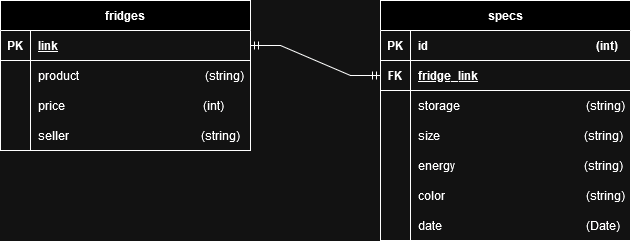

# Web Scraping Project for Exito, Falabella, Alkosto, and Sodimac

## Summary

This project automates the process of web scraping fridges data from major e-commerce platforms [Exito](https://www.exito.com/electrodomesticos/refrigeracion/neveras), [Falabella](https://www.falabella.com.co/falabella-co/category/CATG32130/Refrigeracion?mkid=HB_1_REF_G14_N2_1081&page=1), [Alkosto](https://www.alkosto.com/electrodomesticos/grandes-electrodomesticos/refrigeracion/c/BI_0610_ALKOS), and [Sodimac](https://www.homecenter.com.co/homecenter-co/category/cat10850/neveras-y-nevecones/?currentpage=1) using [Selenium](https://www.selenium.dev/) and stores the scraped data in a [PostgreSQL](https://www.postgresql.org/) database. The data is visualized by [Power Bi](https://www.microsoft.com/en-us/power-platform/products/power-bi). Final Dashboard is available to consult [here](https://app.powerbi.com/view?r=eyJrIjoiNjNhYTBhOTktMDE0YS00Yzg3LTg1ZDctN2JkZjIxNzJiYmE4IiwidCI6ImQ2NDZkM2E4LTdiMTUtNGI1My05ZDkyLTk4MTVmZDYyNzAyYyIsImMiOjR9) or in the .pbix file. The project is developed in [Python](https://www.python.org/) and aims to streamline data collection for market analysis and research.

## Table of Contents

- [Project Overview](#project-overview)
- [Setup and Installation](#setup-and-installation)
  - [Prerequisites](#prerequisites)
  - [Virtual Environment](#virtual-environment)
  - [Installing Dependencies](#installing-dependencies)
  - [Enviromental Variables](#enviromental-variables)
- [Usage](#usage)
  - [Running the Scripts](#running-the-scripts)
  - [Execution Time](#execution-time)
- [Technical Details](#technical-details)
  - [Browser Compatibility](#browser-compatibility)
  - [Expected Output](#expected-output)
- [Viewing the Dashboard](#viewing-the-dashboard)


## Project Overview

This project involves developing a PostgreSQL database by web scraping product data from the following e-commerce websites:
- **Exito**
- **Falabella**
- **Alkosto**
- **Sodimac**

The data is collected using Selenium for automation and then processed and stored in a PostgreSQL database. This facilitates market analysis and data-driven decision-making.

## Setup and Installation

### Prerequisites

- Python 3.11.2
- PostgreSQL 16.3, compiled by Visual C++ build 1938, 64-bit
- Google Chrome or Mozilla Firefox

### Virtual Environment

It's recommended to use a virtual environment to manage dependencies. You can create and activate a virtual environment as follows:

```bash
# Create a virtual environment
python -m venv venv

# Activate the virtual environment (Windows)
.\venv\Scripts\activate

# Activate the virtual environment (macOS/Linux)
source venv/bin/activate
```


### Installing Dependencies

Install the required packages using the requirements.txt file:

```bash
pip install -r requirements.txt
```


### Enviromental Variables

In order to run the codes, several variables need to be set in order to run
- PYTHONPATH (use src has working directory)
- POSTGRES_PASSWORD
- POSTGRES_PORT
- POSTGRES_DB
- POSTGRES_SERVER
- USER_AGENT

## Usage

### Running the Scripts

You can run the scraping scripts using either Chrome or Firefox. Ensure that the appropriate WebDriver (e.g., chromedriver or geckodriver) is installed and added to your PATH.

Example command to run a script:

```bash
python alkosto_scraper.py
```

### Execution Time

  Full run: The script may take between 15 minutes to 1 hour to complete.


  Quick run: Scraping about 50 links per store/script takes approximately 5 to 10 minutes.


## Technical Details
### Browser Compatibility

The scraping scripts are compatible with both Google Chrome and Mozilla Firefox. Make sure you have the corresponding WebDriver:

    Chrome: Download Chromedriver
    Firefox: Download Geckodriver

### Expected Output

The scripts will scrape product details such as:

    Product name
    Price
    space (liters)
    energy consumption
    Product URL

The following entity diagram shows the expected output of information scraped from websites:



The data is then saved into the PostgreSQL database configured in your setup.
## Viewing the Dashboard

To view the interactive project dashboard:

You can view the interactive dashboard [here](https://app.powerbi.com/view?r=eyJrIjoiNjNhYTBhOTktMDE0YS00Yzg3LTg1ZDctN2JkZjIxNzJiYmE4IiwidCI6ImQ2NDZkM2E4LTdiMTUtNGI1My05ZDkyLTk4MTVmZDYyNzAyYyIsImMiOjR9).
    
